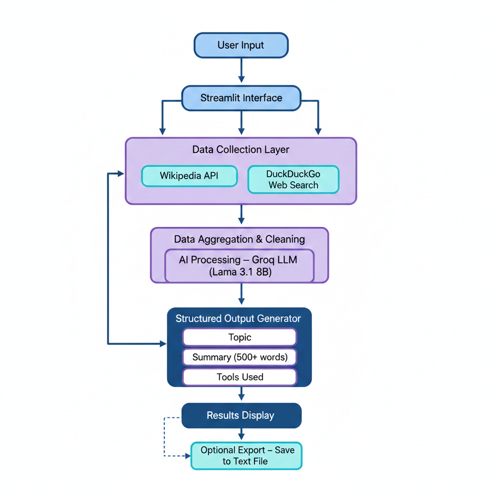

# 🌌 CosmicQuery

**AI-powered research assistant using Wikipedia & Web Search**

CosmicQuery is a comprehensive research tool that combines the power of AI with multiple data sources to provide detailed, structured research on any topic. Built with Streamlit and powered by Groq's LLM, it delivers professional research summaries with proper source attribution.

## 📁 Project Structure

```
cosmicquery/
├── app.py              # Main Streamlit application
├── main.py             # Command-line interface
├── schemas.py          # Pydantic data models
├── tools.py            # Research tools (Wikipedia, Web Search, File Save)
├── requirements.txt    # Python dependencies
├── .env               # Environment variables (create this)
├── README.md          # Project documentation
└── venv/              # Virtual environment (created during setup)
```
## 📸 Project Workflow

<p align="center">
  
</p>


## ✨ Features

- **Dual Data Sources**: Combines Wikipedia content with web search results for comprehensive coverage
- **AI-Powered Analysis**: Uses Groq's Llama 3.1 8B model for intelligent content synthesis
- **Structured Output**: Provides organized summaries with clear sections and source tracking
- **Professional Interface**: Clean, intuitive Streamlit web interface
- **Export Functionality**: Save research results to text files
- **Source Attribution**: Tracks and displays all sources used in research

## 🛠️ Usage

### Web Interface

1. Enter your research topic in the input field
2. Click "Start Research"
3. View comprehensive results with sources
4. Optionally save results to file


## 🔍 How It Works

1. **Input Processing**: User enters a research topic
2. **Data Collection**: 
   - Wikipedia API fetches relevant articles (top 3 results, 4000 chars max)
   - DuckDuckGo search retrieves current web information
3. **AI Analysis**: Groq's Llama 3.1 processes combined data sources
4. **Structured Output**: Results formatted as JSON with:
   - Topic name
   - Detailed summary (500+ words)
   - Source list
   - Tools used
5. **Presentation**: Clean, organized display in web interface

## 📊 Output Format

Each research result includes:

- **Topic**: Refined topic name
- **Summary**: Comprehensive analysis (minimum 500 words)
- **Sources**: List of all referenced materials
- **Tools Used**: Research methods employed

## 🔧 Technical Details

### Dependencies

- **Streamlit**: Web interface framework
- **LangChain**: LLM orchestration and tooling
- **Groq**: Fast LLM inference
- **Pydantic**: Data validation and parsing
- **DuckDuckGo Search**: Web search functionality
- **Wikipedia API**: Encyclopedia content access

### AI Model

- **Model**: Llama 3.1 8B Instant
- **Provider**: Groq
- **Temperature**: 0.4 (balanced creativity/accuracy)
- **Output**: Structured JSON format


